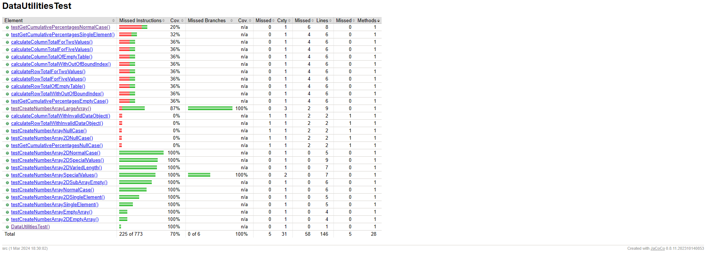
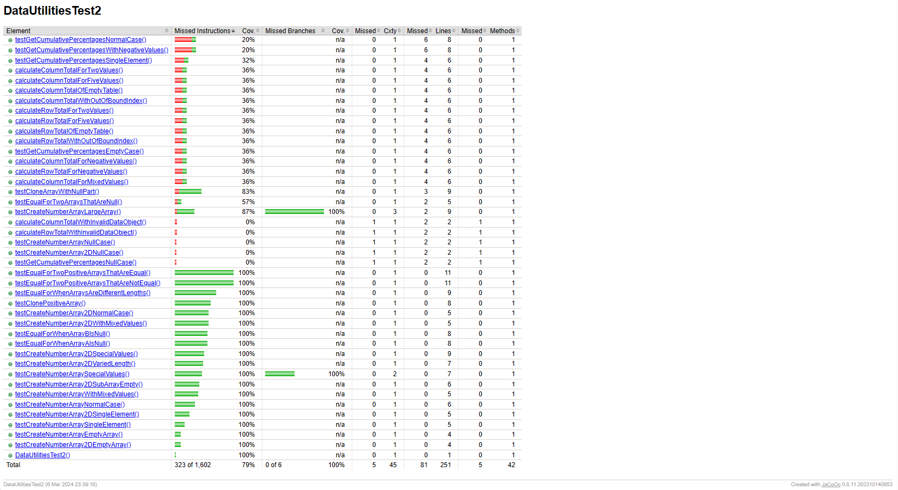

**SENG 438 - Software Testing, Reliability, and Quality**

**Lab. Report #3 – Code Coverage, Adequacy Criteria and Test Case Correlation**

| Group \#:      |     |
| -------------- | --- |
| Student Names: |     |
|                |     |
|                |     |
|                |     |

(Note that some labs require individual reports while others require one report
for each group. Please see each lab document for details.)

# 1 Introduction

Text…

# 2 Manual data-flow coverage calculations for X and Y methods

Text…

# 3 A detailed description of the testing strategy for the new unit test

Text…

# 4 A high level description of five selected test cases you have designed using coverage information, and how they have increased code coverage

Text…

# 5 A detailed report of the coverage achieved of each class and method (a screen shot from the code cover results in green and red color would suffice)

Coverage Report of the Original Test classes 
Range test:   

DataUtilitiesTest:

Coverage Report of the Revised Test classes
Range test: 

DataUtilitiesTest:

# 6 Pros and Cons of coverage tools used and Metrics you report

PROS: 
-As opposed to the other coverage tools, we found EclEmma easy to set up and integrate with the Eclipse IDE
-it provided various coverage metrics such as statement coverage, branch coverage which allowed us to asses the quality of our tests and make new tests to improve the coverage metrics.
-it provided a detailed report and outlined all the areas of the ode that weren't outlined by the code 

CONS: 
- the eclemma tool provided a coverage without the condition coverage

Statement Coverage Metric
PROS:
- it provided a basic measure of how much of the code has been executed by the test cases. 
- it was easy to understand and interpret

CONS: 
- it does not ensure that all possible execution paths in the code have been tested, 

Branch Coverage Metric
PROS: it provided a more detailed measure of test coverage by evaluating whether all possible outcomes of various decision points in the code have been tested.

CONS: it does not not guarantee comprehensive testing of all possible code paths, as it focuses on decision points rather then individual condition within the decisions

Text…

# 7 A comparison on the advantages and disadvantages of requirements-based test generation and coverage-based test generation.

Text…

# 8 A discussion on how the team work/effort was divided and managed

Text…

# 9 Any difficulties encountered, challenges overcome, and lessons learned from performing the lab

Text…

# 10 Comments/feedback on the lab itself

Text…
